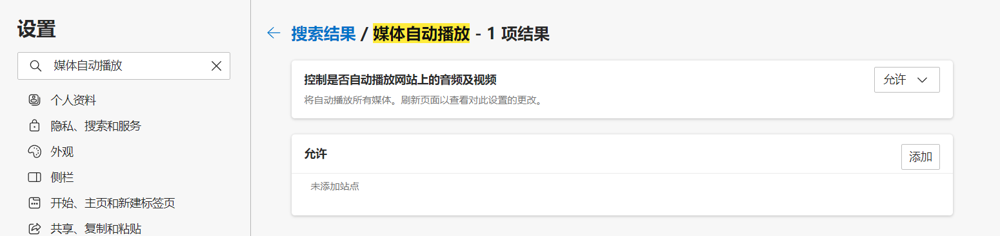
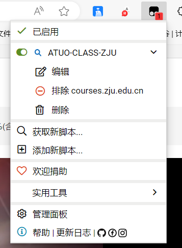

# Auto-video-tronclass-zju
### 自动刷课-学在浙大油猴脚本  
### 使用说明：
1. 请使用Edge浏览器，如果您有一定的前端知识并且可以在chrome中调试运行
2. 在Edge浏览器->设置中，搜索 “媒体自动播放”，并修改为允许
   

3. 在Edge浏览器->扩展程序中，获取tampermonkey插件并启用  

4. 油猴->添加新脚本，将js文件内容复制进新脚本中并保存 

5. 打开视频播放页面例如https://courses.zju.edu.cn/course/*/learning-activity/full-screen#/*的网址格式  

6. 开启用户脚本并**刷新页面**即可自动播放

### 注意：  
1. **进入视频播放界面时，请保持脚本关闭**。  

2. **选定开始的视频后开启脚本,并刷新页面即可**  

3. 如果出现视频没有自动播放，有可能是网速过慢，在脚本中将opentime&switchtime变量的值增加，单位为ms  
4. 为了方便起见，脚本等待的时间为视频的全程，如果不是从开头播放，则会多等一些时间再切换
5. Only Tested on 公选课“四史”

